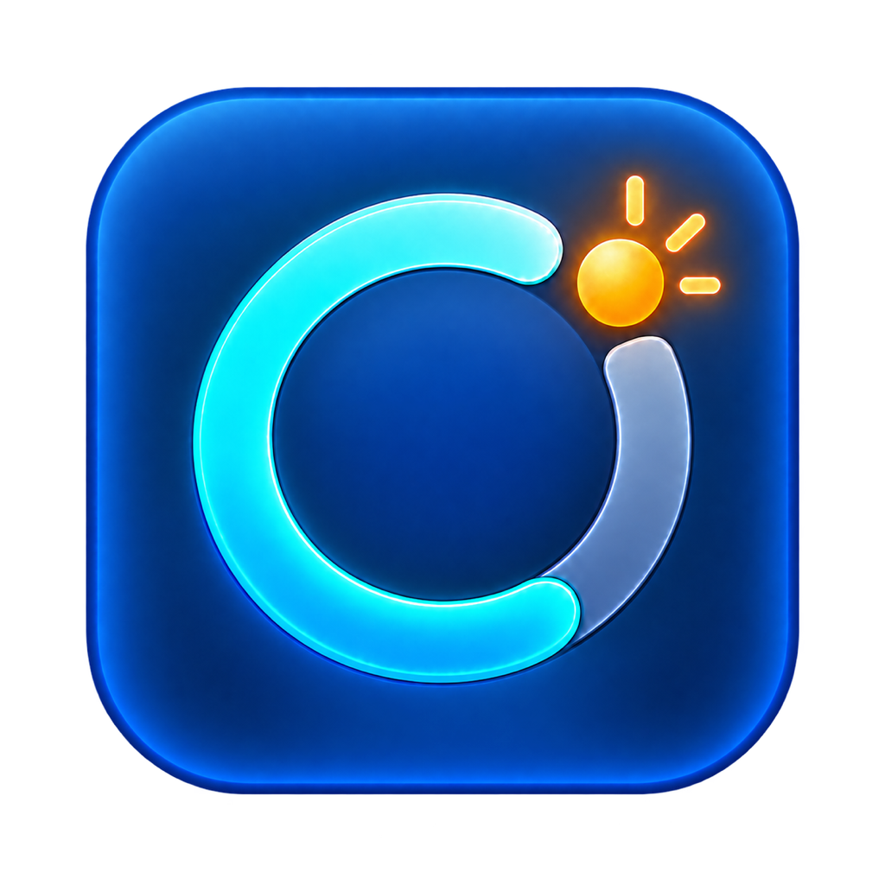

# Codex Usage Alert / Codex 用量预警

<p align="center">
  
</p>

一个原生 macOS 菜单栏用量监控器。它通过本机 `codex app-server` 读取当前 ChatGPT/Codex 额度窗口与 Token 活动数据，并在用量偏高时发送系统通知。

> 本项目是独立的开源工具，不是 OpenAI 官方产品。应用不会要求或保存你的账号密码、Cookie 或 API Key。

## 功能

- 菜单栏显示当前周期已用百分比
- 菜单栏使用 16pt 专用无阴影矢量图标
- 点击应用图标打开完整仪表盘，同时保留菜单栏入口
- 关闭主窗口或按 `Command + Q` 后继续在菜单栏后台监控；菜单栏电源按钮用于完全退出
- 自动刷新频率可设置，默认 15 分钟；也可选择固定时间刷新
- 显示已用额度、剩余额度、额度周期和重置时间
- 首页按重要性突出“今日已用、今日上限、今日剩余”，周期额度作为辅助信息展示
- 支持跟随系统、简体中文和 English；首次使用默认跟随系统，非中文系统使用英文
- 按本地自然日记录用量变化，估算今天已使用的百分比
- 按额度窗口计算可持续日均预算；若昨日低于日均，未用部分会加到用户设置的基础上限
- 仪表盘展示可配置的规则刻度，以及每日建议、昨日已用、昨日余量和今日上限及其来源
- 四档预警阈值可分别设置；修改基础上限时，前三档会自动等比例缩放
- 同一阈值当天只通知一次，避免重复打扰
- 显示 Token 今日、昨日、本月累计、历史累计和截至今天的最近 7 个本机自然日趋势；每列显示星期与日期，悬停或点击时在图表上方显示精确用量，并用引导线指向当前柱形
- 周期额度和 Token 数据来自 Codex 服务端；今日增量、昨日结转和个人预算由本机快照计算，新设备从首次刷新开始记录
- Token 数量单位可独立切换中文（万、亿）或英文（K、M、B）
- 内置通知测试、通知设置入口和登录时自动启动
- 设置中显示 `V版本号（build 构建号）` 和完整更新记录
- 各数据区域提供独立 info 浮窗，集中展示计算方式、数据来源和统计口径
- 附带 `codex-usage` JSON 命令行读取器

## 系统要求

- macOS 13 或更高版本
- Swift 6 工具链
- 本机已安装 Codex CLI 或 ChatGPT/Codex macOS 应用
- 已使用支持 Codex 服务的 ChatGPT 身份登录

## 数据来源

应用启动本机 `codex app-server`，使用官方 JSON-RPC 方法：

- `account/rateLimits/read`：额度窗口、已用百分比和重置时间
- `account/usage/read`：Token 活动摘要和每日数据

本机 Codex CLI/App Server 是访问服务端数据的桥梁，不是额度与 Token 总量的数据源。周期已用、剩余、重置时间以及 Token 摘要和每日统计由 Codex 服务端返回；只有“今日已用”、昨日额度用量和结转预算依赖本机保存的连续记录，因此无法自动跨电脑继承。

可持续日均按 `100 ÷ 额度窗口天数` 在本机计算。昨日已用优先来自应用保存的本机额度快照，公式为 `今日上限 = 用户基础上限 + max(0, 可持续日均 - 昨日已用)`（最高 100%）。例如基础上限为 20%、七日窗口的日均约为 14.3%，昨日用了 7%，则昨日余量为 7.3%，今日上限为 27.3%。若当前额度窗口恰好从昨日开始但缺少完整昨日记录，应用可用今天首次周期累计基线作带 `≈` 标记的估算，并注明它可能包含首次快照前的今日用量；其他缺失情形不按零用量结转。

Token 每日数据以 `account/usage/read` 返回的 `dailyUsageBuckets` 为准。官方文档没有说明 `startDate` 的时区，因此应用采用统一的本机显示规则：服务端最新一条每日统计作为今天、上一条作为昨天，并把同一批图表日期整体平移到本机日期；服务端原始日期仅用于排查。本月累计也按适配后的本机日期计算。应用不读取定位权限；本机日期是否跟随所在地取决于 macOS 的时区设置。

Token 活动接口不可用时，额度监控仍会继续工作。基础上限默认是 `20%`，可在设置中修改；它是个人每日预算，不是 OpenAI 官方硬限制。

参考：[Codex App Server 文档](https://learn.chatgpt.com/docs/app-server)

## 构建与运行

日常开发和调试使用 App 沙盒开发版：

```bash
swift test
./scripts/build_sandbox_app.sh
open "dist-sandbox/Codex Usage Alert.app"
```

GitHub 开源发布使用正常安装版：

```bash
swift test
./scripts/build_app.sh
open "dist/Codex Usage Alert.app"
```

两版来自同一套源码并共用 `Resources/AppIcon.icns`，但使用不同的 Bundle ID、权限和输出目录。开发时只运行沙盒版；正常安装版仅在发布验证时启动。首次启动时，请在 macOS 权限提示中允许系统通知。详细规则见[双版本构建与代码管理](docs/build-variants.md)。

命令行读取器：

```bash
swift run codex-usage --pretty
```

## 项目结构

```text
Sources/UsageCore/          数据模型、规则与 App Server 客户端
Sources/CodexUsageAlert/    SwiftUI 应用、监控和系统通知
Sources/CodexUsageCLI/      JSON 命令行读取器
Tests/UsageCoreTests/       核心逻辑测试
Resources/                  Info.plist 与应用图标
scripts/build_app.sh        .app 构建及临时/Developer ID 签名脚本
scripts/build_sandbox_app.sh App 沙盒开发版构建脚本
scripts/sync_version.sh     按 Git 提交次数同步版本号与 Build
scripts/build_dmg.sh        Developer ID 签名、DMG 打包与可选公证脚本
docs/                       开发计划、提示词和项目文档
```

## 项目文档

项目文档统一保存在 [`docs`](docs/README.md) 目录，包括：

- [Mac App Store 开发计划](docs/app-store-development-plan.md)
- [Mac App Store 上架资料](docs/app-store-metadata.md)
- [双版本构建与代码管理](docs/build-variants.md)
- [版本号与更新记录规则](docs/versioning.md)
- [从零生成 Codex 用量预警的完整开发提示词](docs/development-prompt.md)

## 分发说明

日常 `.app` 构建默认使用临时签名。`scripts/build_dmg.sh` 会自动查找 Developer ID Application 证书，为正常安装版和 DMG 正式签名，并在设置 `NOTARY_PROFILE` 时提交 Apple 公证。Mac App Store 版本仍需要完成正式 Xcode 分发工程改造，详见[开发计划](docs/app-store-development-plan.md)。

## 隐私

- 用量数据仅在本机展示和保存必要的每日基线。
- 不收集账号邮箱、凭据或完整 App Server 日志。
- 不包含遥测或第三方分析 SDK。

## License

[MIT](LICENSE)
